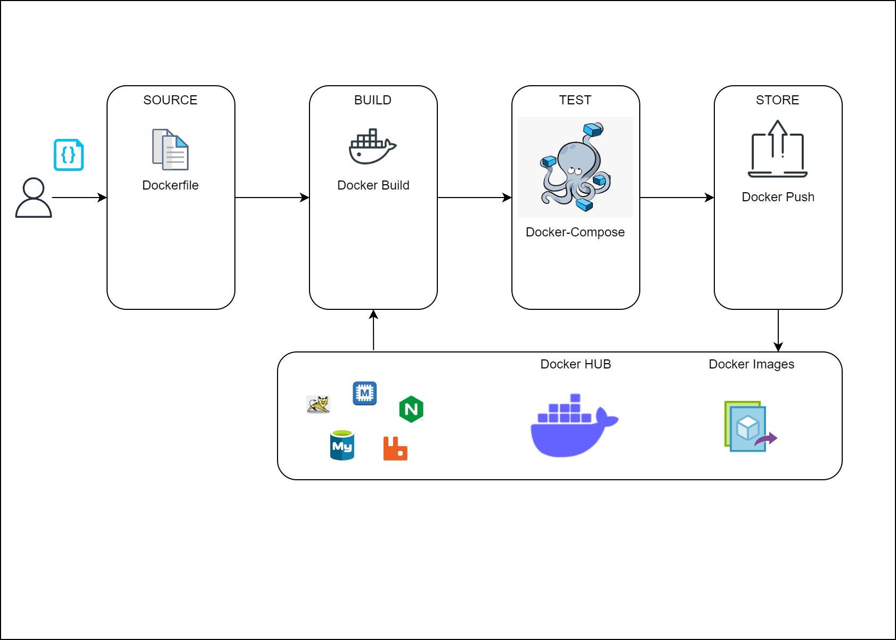

# Docker-app-container
## Containerizing a Java Application with Docker
### Overview
In this project, I aim to understand the ins and outs of containerizing a Java application. The goal was to encapsulate both the application and its dependencies into a coherent, portable environment, simplifying deployment and enabling seamless scalability.

###  The Motivation Behind Containerization?
I chose to delve into Docker, to craft a Docker container for a Java application.  Docker is a linchpin for bundling applications and dependencies, ensuring consistent and repeatable deployments across diverse environments. Here are some of the insights gained:
1. **Efficient Resource Utilization**: containers are lean, making them ideal for microservice design, thereby enabling scalability and cost efficiency
2. **Microservices Ready**: Containerization aligns with microservices, enabling you to break down your application into smaller, manageable components.
3. **Image-Based Deployment**: Deployments are based on container images, ensuring that the exact same environment is reproduced every time you deploy. This consistency minimizes the risk of unexpected issues in different environments.
4. **Reusable and Repeatable**: Docker containers are highly reusable and can be easily replicated. This repeatability simplifies development, testing, and production workflows.


### Project Goals:
1.	**Grasp Containerization Concepts:** Understand the essentials and benefits of containerization.
2.	**Acquire Docker Fundamentals:**: Gain proficiency in Docker basics, focusing on its core components, architecture, and interactions.
3.	**Create and Customize Docker Images**:
•	Learn to find, create, and customize Docker images to fit specific application needs.
•	Understand how to write Dockerfiles to define the application environment.
4.	**Implement Docker Compose:** 
•   Develop skills in defining and managing multi-container Docker applications using `docker-compose.yml`.
5.	**Deploy Docker Containers:** Understand the deployment process of Docker containers on real-world application.
•	Hosting and managing Docker containers on Docker Hub.
6.	Practical Application:
•	Apply theoretical knowledge and troubleshooting skills in containerizing a Java application
•	Validate the working of the containerized application and troubleshoot any issues.


### Prerequisites
Before diving in, I ensured the installation / sign up:

- [Docker](https://www.docker.com/get-started)
- [Docker Compose](https://docs.docker.com/compose/install/)
- [Docker Hub](https://hub.docker.com/) (for publishing your container)


## Implementation Steps

1. **Setup Stack Services** This was a revisit to the learnings from [vprofile-local project](https://github.com/myacov/vprofile-local)
2. **Find Base Images from dockerhub:** Scouring Docker Hub for suitable base images was the next step
3. **Write Dockerfiles:** Customizing the images as per project necessities 
4. **Compose Docker:** `docker-compose.yml` files for managing multiple containers
5. **test & host** The final step involved validating and hosting the images on Docker Hub.

## Architecture Overview



## Detailed Steps
### Step 1: VM Setup for Docker Engine:
Initiating a VM with Vagrant and allocating adequate RAM memory paved the way for [installing Docker Engine on Ubuntu](https://docs.docker.com/engine/install/ubuntu/). Adding the vagrant user to the docker group

A Virtual Machine (VM) was initiated with Vagrant, ensuring it was equipped with adequate RAM. Docker Engine was then installed on this Ubuntu-based VM. The vagrant user was added to the Docker group using the following command:
```bash
usermod -aG docker vagrant
```

### Step 2: Repositories Creation on DockerHub
1. [`vprofile_app`](./Docker-files/app/Dockerfile)
2. [`vprofile_db`](./Docker-files/db/Dockerfile)
3. [`vprofile_web`](./Docker-files/web/Dockerfile)


### Step 3: Building and Testing with Docker-Compose

The [`docker-compose.yml`](./docker-compose.yml) file was used to build and test the services. The services were started, and their statuses checked. The IP address was retrieved to access the application through a web browser.
```bash
docker compose build
docker images
docker compose up -d
docker ps
ip addr show
```

Credentials for access:
```
user: adnin_vp
password: adnin_vp
```
### Step 4: Pushing Images to DockerHub

The Docker images were pushed to DockerHub repositories after logging in.

```bash
docker login
docker push USER/vprofile_app
docker push USER/vprofile_web
docker push USER/vprofile_db
```

## Usage Instructions
The project can be replicated and utilized by following the instructions and using the Dockerfiles and docker-compose.yml provided above. These files detail the configuration and the setup required for the Java application, database, and web server.

## Conclusion 
Containerizing a Java application with Docker provides an efficient, scalable, and consistent environment for deployment. This project has demonstrated the steps and considerations involved in this process, serving as a guide for those looking to containerize their applications.

## References and Documentation: 
- [Dockerfile Reference](https://docs.docker.com/engine/reference/builder/) 

- Project is part of [DevOps Course](https://www.udemy.com/course/decodingdevops/) on udemy.
